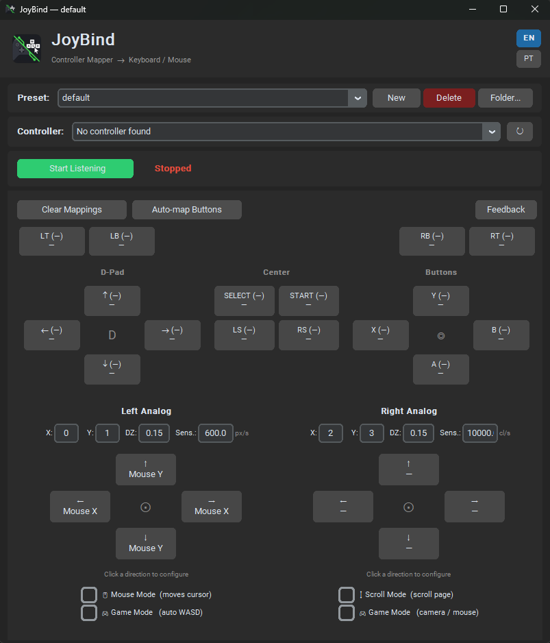

<div align="center">

# JoyBind

**Map any controller (joystick/gamepad) to keyboard and mouse on Windows — no drivers required**

[](https://github.com/MateusRestier/joybind/releases)

</div>

---

<div align="center">

</div>

---

## What is JoyBind?

JoyBind turns any USB or Bluetooth controller into a full keyboard and mouse on Windows. Plug in your controller, configure the buttons through the visual interface and click **Start Listening** — that's it.

No special drivers needed. Works with any game or application that accepts keyboard and mouse input.

---

## Use Cases

| Scenario | Example configuration |
|---|---|
| **Minecraft** | Left stick → mouse, buttons → hotbar (`1`–`9`), jump (`space`), inventory (`e`); inventory scroll with `scroll_up` / `scroll_down` |
| **Emulators (PCSX2, RPCS3, Dolphin...)** | Play titles with no native controller support by mapping mouse clicks and movements to physical buttons |
| **GOW2 / rapid clicking** | *Macro Mode*: hold a button and it fires clicks automatically at the interval you define (e.g. 60 ms) |
| **Side mouse buttons** | Map `mouse4` and `mouse5` (side mouse buttons) to controller buttons |
| **PC navigation** | Use the controller as a full mouse for streaming, YouTube and general navigation without leaving the couch |

---

## Download and Installation

### Ready-to-use executable *(recommended)*

Download the `.exe` from the releases page — Python not required:

<div align="center">

[](https://github.com/MateusRestier/joybind/releases)

</div>

### From source code

Requires Python 3.11+ and Windows 10/11:

```bash
git clone https://github.com/MateusRestier/joybind.git
cd joybind
pip install -r requirements.txt
python main.py
```

#### Dependencies

| Package | Minimum version | Purpose |
|---|---|---|
| `customtkinter` | 5.2.0 | Modern graphical interface |
| `pygame` | 2.5.0 | Joystick/gamepad reading |
| `pyautogui` | 0.9.54 | Keyboard and mouse simulation |
| `pynput` | 1.7.6 | Key capture in the bind wizard |

---

## How to Use

1. Connect the controller before opening the program (or click **↻** after connecting)
2. Select the controller in the **Controller** dropdown
3. Click any tile in the visual layout to configure the mapping
4. Close the dialog — the configuration is saved automatically to the active preset
5. Click **Start Listening** and start using

---

## Features

- **Button mapping** — associate each physical button with:
  - A single key or combination (`enter`, `f5`, `ctrl+z`, ...)
  - Mouse buttons, including side buttons (`mouse4`, `mouse5`) and scroll (`scroll_up`, `scroll_down`)
  - An action sequence with timing (move cursor, click, press key, wait)
- **Hold while pressed** — keeps the key held while the physical button is held down (ideal for running in games)
- **Macro Mode (auto-click)** — fires the action repeatedly at the defined interval (ms) while the button is held
- **Stick as mouse** — the left stick controls the cursor with configurable sensitivity
- **Stick as scroll** — the right stick scrolls the page vertically and horizontally
- **Manual stick mode** — maps each direction (↑↓←→) of each stick to a key, combo or sequence
- **Presets** — save and load named configurations; switch without restarting
- **Visual gamepad layout** — controller silhouette with all buttons clickable
- **Auto-capture** — detects the physical button or key when pressed, no need to type indices manually
- **EN/PT interface** — language selector in the header; preference is saved and applied on restart

---

## Button Configuration

Click any tile in the visual layout to open the configuration dialog. The tile shows an icon based on the mode:

| Icon | Meaning |
|---|---|
| `⌨ key` | Single key (press and release) |
| `⬇ key` | Hold while pressed |
| `⟳ key` | Macro Mode (auto-click) |
| `▶` | Action sequence |
| `—` | No mapping |

### Type: Keyboard

Presses and releases a key, combination or mouse button.

| Option | Description |
|---|---|
| **Key** | Key name (e.g. `enter`, `f5`, `ctrl+z`) or mouse button (see table below) |
| **Duration (ms)** | Time between press and release (0 = instant) |
| **Hold while pressed** | Keeps the key held while the controller button is held down |
| **Macro Mode** | Fires the key repeatedly at the defined interval (ms) while the button is held |

Use the **Capture** button to detect the key or mouse button automatically — including `mouse4` and `mouse5`.

**Available mouse keys:**

| Value | Action |
|---|---|
| `mouse_left` | Left click |
| `mouse_right` | Right click |
| `mouse_middle` | Middle click |
| `mouse4` | Back side button |
| `mouse5` | Forward side button |
| `scroll_up` | Scroll up (1 wheel click) |
| `scroll_down` | Scroll down (1 wheel click) |

> For continuous scroll while holding a button, use *Macro Mode* with `scroll_up` or `scroll_down` and a short interval (e.g. 80 ms).

### Type: Action Sequence

Executes an ordered list of steps. Useful for complex macros with multiple clicks, mouse movements and waits.

| Action | Parameters | Description |
|---|---|---|
| `move_mouse` | X, Y, Save/Restore | Teleports the cursor to the position |
| `click_left` | — | Left click at current position |
| `click_right` | — | Right click at current position |
| `click_middle` | — | Middle click at current position |
| `double_click` | — | Double click at current position |
| `scroll_up` | Clicks (default 3) | Scroll up |
| `scroll_down` | Clicks (default 3) | Scroll down |
| `key` | Key name | Press and release a key |
| `delay` | Milliseconds (default 100) | Pause between steps |

> **Save/Restore position:** when enabled on a `move_mouse` step, the cursor returns to its original position at the end of the sequence — ideal for clicking fixed screen elements without losing the working position.

---

## Analog Configuration

Enable with the **Mouse Mode** toggle in the central section of the layout.

### Mouse Mode (enabled)

| Stick | Behavior |
|---|---|
| Left (axes 0/1) | Moves the cursor — sensitivity in px/s |
| Right (axes 2/3) | Scrolls the page — sensitivity in cl/s |

### Manual Mode (disabled)

Each direction of each stick can be mapped independently to:

| Type | Extra parameters | Description |
|---|---|---|
| `none` | — | No action |
| `mouse_x` | `sensitivity` (px/s) | Move cursor horizontally |
| `mouse_y` | `sensitivity` (px/s) | Move cursor vertically |
| `scroll_v` | `sensitivity` (cl/s) | Vertical scroll |
| `scroll_h` | `sensitivity` (cl/s) | Horizontal scroll |
| `key` | `key` (key name or combo `ctrl+c`) | Repeats the key/combo while the stick is active (~15×/s) |
| `sequence` | `steps` (list of steps) | Fires the sequence once when crossing the deflection threshold |

### Parameters per stick

| Field | Description |
|---|---|
| **Axis X** | pygame index of the horizontal axis |
| **Axis Y** | pygame index of the vertical axis |
| **DZ** | Deadzone — fraction of maximum deflection ignored (0.0–0.99) |
| **Sens.** | Sensitivity in px/s (mouse) or cl/s (scroll) |

> **Finding the axes:** enable the listener, move the stick and watch the console output — the axes with the greatest variation are the correct ones.

---

## Preset System

Each preset is an independent `.json` file. The preset folder can be changed with the **Folder...** button.

| Operation | How to do it |
|---|---|
| Create new preset | **New** button → enter the name |
| Switch preset | **Preset** dropdown |
| Save changes | Automatic when closing configuration dialogs |
| Change folder | **Folder...** → choose the directory |

The last opened preset is remembered between sessions.

---

## Preset Format (JSON)

```jsonc
{
  "binds": {
    // Single key: button 0 → Enter
    "0": { "type": "keyboard", "key": "enter" },

    // Hold while pressed: button 1 → Shift held down
    "1": { "type": "keyboard", "key": "shift", "hold_while_pressed": true },

    // Macro Mode: button 2 → left click every 60 ms while held
    "2": { "type": "keyboard", "key": "mouse_left", "macro_interval_ms": 60 },

    // Scroll up via controller button
    "4": { "type": "keyboard", "key": "scroll_up" },

    // Side mouse button (mouse4)
    "5": { "type": "keyboard", "key": "mouse4" },

    // Sequence: button 3 → move mouse, click and press F5
    "3": {
      "type": "sequence",
      "steps": [
        { "action": "move_mouse", "x": 960, "y": 540, "save_restore": true },
        { "action": "click_left" },
        { "action": "delay", "ms": 200 },
        { "action": "key", "key": "f5" }
      ]
    }
  },

  "analog": {
    // true = mouse mode (left→cursor, right→scroll); false = manual direction mode
    "enabled": true,

    "sticks": [
      {
        "label": "Left", "axis_x": 0, "axis_y": 1,
        "deadzone": 0.15, "sensitivity": 600.0,
        "up":    { "type": "mouse_y", "sensitivity": 600 },
        "down":  { "type": "mouse_y", "sensitivity": 600 },
        "left":  { "type": "mouse_x", "sensitivity": 600 },
        "right": { "type": "mouse_x", "sensitivity": 600 }
      },
      {
        "label": "Right", "axis_x": 2, "axis_y": 3,
        "deadzone": 0.15, "sensitivity": 10000.0,
        "up":    { "type": "key",      "key": "w" },
        "down":  { "type": "key",      "key": "ctrl+z" },
        "left":  { "type": "scroll_h", "sensitivity": 8 },
        "right": { "type": "sequence", "steps": [{ "action": "key", "key": "ctrl+tab" }] }
      }
    ]
  }
}
```

---

## Notes

- **FailSafe:** move the mouse to the top-left corner of the screen to abort any running sequence (default pyautogui behavior).
- **Horizontal scroll:** implemented via `Shift + scroll` for maximum compatibility with Windows applications (Chrome, VS Code, Office, etc.).
- **Raw Input / games:** mouse buttons and scroll use Windows `SendInput`, ensuring compatibility with games that read input via Raw Input.
- **Axes with "diagonal" values:** some controllers map axes at 45°. If the stick responds incorrectly, swap the Axis X and Axis Y values or use negative sensitivity to invert the signal.

---

## Troubleshooting

### Controller doesn't appear in the dropdown

1. Connect the controller **before** opening the program, or click **↻** after connecting.
2. Check that the controller is recognized by Windows (Control Panel → Game Controllers).
3. Some Bluetooth controllers require a few seconds after pairing.
4. If the controller appears with a generic name ("Controller #0"), it will still work normally for reading buttons and axes.

### Button doesn't respond when pressed

- Confirm that **Start Listening** is active (green indicator).
- The configured index may not match the physical button — use **Capture** in the dialog to detect the correct index.
- Press the button for at least 50 ms (polling runs at 60 Hz ≈ 16 ms per frame).

### Keyboard actions don't work in the game/application

- Run JoyBind as **Administrator**.
- For games with anti-cheat, software-based mapping may be blocked by design.

### Stick moves the mouse erratically or in the wrong direction

- Check the **Axis X** and **Axis Y** indices — swap them if the axes are reversed.
- Increase the **DZ** (deadzone) value if the cursor moves with the stick released.
- Negative sensitivity inverts the axis direction.
- Enable the listener and move the stick — the console displays raw values for diagnosis.

### Sequence interrupted in the middle

- The mouse may have reached the top-left corner of the screen (pyautogui FailSafe). Disable with `pyautogui.FAILSAFE = False` in `actions.py` if needed.
- Check if any step has a very long `delay`.

### Preset not saving / corrupted file

- The program saves with atomic writes (`.tmp` → `rename`). Check that the folder has write permission.
- If `settings.json` disappears, the program recreates it with defaults on next launch.

---

## Key Name Reference

Use the names below in key fields. Compatible with pyautogui.

### Special keys

| Name | Key |
|---|---|
| `enter` | Enter / Return |
| `space` | Space bar |
| `tab` | Tab |
| `backspace` | Backspace |
| `delete` | Delete |
| `escape` | Escape |
| `up` / `down` / `left` / `right` | Arrow keys |
| `home` / `end` | Home / End |
| `pageup` / `pagedown` | Page Up / Page Down |
| `insert` | Insert |
| `f1` … `f12` | Function keys |
| `printscreen` | Print Screen |
| `scrolllock` | Scroll Lock |
| `pause` | Pause/Break |
| `capslock` | Caps Lock |
| `numlock` | Num Lock |

### Modifiers

| Name | Key |
|---|---|
| `ctrl` / `ctrlleft` / `ctrlright` | Control |
| `shift` / `shiftleft` / `shiftright` | Shift |
| `alt` / `altleft` / `altright` | Alt |
| `win` | Windows / Super |

### Numpad

| Name | Key |
|---|---|
| `num0` … `num9` | Numpad 0–9 |
| `add` | Numpad + |
| `subtract` | Numpad − |
| `multiply` | Numpad × |
| `divide` | Numpad ÷ |
| `decimal` | Numpad . |
| `numpadenter` | Numpad Enter |

### Combos

Combine modifiers with `+`:

```
ctrl+c          → Copy
ctrl+shift+esc  → Task Manager
alt+f4          → Close window
win+d           → Show desktop
ctrl+alt+delete → (works only partially via software)
```

> **Tip:** use the **Capture** button in the bind dialog to automatically detect the correct name when you press the desired key.

---

## For Developers

- [CHANGELOG.md](CHANGELOG.md) — version history and changes
- [CONTRIBUTING.md](docs/CONTRIBUTING.md) — code conventions, preset format, extension guides
- [ARCHITECTURE.md](docs/ARCHITECTURE.md) — how each file works, why decisions were made, full flow of an action from button to OS
